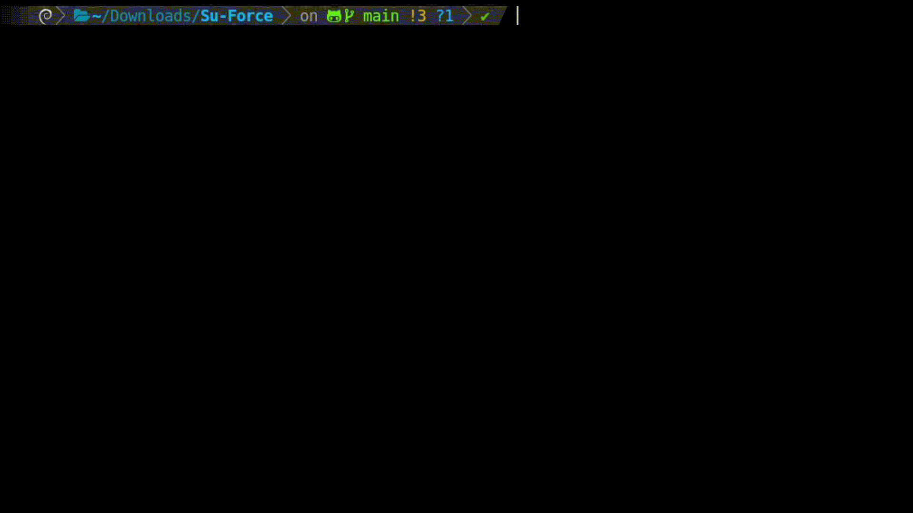

# Su-Force | Local Password Auditing Tool


Herramienta para la auditoría de contraseñas mediante ataques de diccionario contra **usuarios locales del sistema linux**, diseñada para demostrar los riesgos asociados al uso de contraseñas débiles en entornos Linux controlados.


## ⚠️ Descargo de responsabilidad
Este proyecto ha sido desarrollado **exclusivamente con fines educativos y demostrativos**, orientado al estudio de la seguridad de contraseñas y pruebas controladas en sistemas locales.

No me hago responsable del uso indebido de esta herramienta ni de cualquier daño o impacto causado por su ejecución fuera de entornos autorizados.  
El uso de Su-Force debe limitarse estrictamente a **laboratorios, sistemas propios o entornos donde se cuente con autorización explícita**.

El usuario es el único responsable de cumplir con la legislación y normativas vigentes en su país.


## Características del proyecto
- Ataque de diccionario contra usuarios locales del sistema.
- Soporte para ejecución paralela mediante subprocesos (no permitido para root).
- Validación estricta de argumentos y archivos de entrada.
- Manejo seguro de interrupciones (CTRL+C).
- Salida clara y legible en consola.
- Modo verbose opcional para seguimiento detallado.
- Enfoque educativo, controlado y no persistente.


## Funcionamiento
Su-Force sigue un flujo de ejecución estructurado y seguro:

1. Validación de argumentos y opciones de ejecución.
2. Verificación de la existencia del usuario objetivo.
3. Validación del diccionario de contraseñas (existencia, permisos y contenido).
4. Configuración del modo de ejecución (secuencial o paralela).
5. Prueba de contraseñas utilizando el comando `su`.
6. Uso de `timeout` para evitar bloqueos o ejecuciones prolongadas.
7. Finalización inmediata al encontrar credenciales válidas.
8. Restauración y cierre seguro del proceso.

El diseño prioriza la **estabilidad del sistema anfitrión** y la transparencia del proceso.


## Tecnologías y requisitos
SU-Force está desarrollado completamente en `bash`, utilizando herramientas estándar disponibles en sistemas Linux.

### Tecnologías
- Lenguaje: Bash
- Entorno: Linux
- Utilidades del sistema: `su`, `sudo`, `timeout`, `xargs`, `coreutils`

### Requisitos
- Sistema operativo Linux
- Acceso a usuarios locales del sistema
- Diccionario de contraseñas legible y no vacío
- Permisos adecuados según el usuario objetivo


## 🚀 Instalación y uso
Clona el repositorio y accede al directorio del proyecto:

```bash
git clone https://github.com/crisstianpd/su-force.git
cd su-force
```

Otorga permisos de ejecución al script:
```bash
chmod +x suforce.sh
```

Ejecuta la herramienta:
```bash
./suforce.sh [-v][-h] <user> <dictionary.txt> [subprocesses]
```

### Ejemplos de uso
```bash
# Panel de uso
./suforce.sh -h

# Ejecución básica
./suforce.sh user wordlist.txt

# Modo verbose
./suforce.sh -v user wordlist.txt

# Ejecución paralela (usuarios no root)
./suforce.sh user wordlist.txt 4

# Auditoría contra root (sin paralelismo)
./suforce.sh root wordlist.txt
```

## Estructura del proyecto
```bash
Su-Force/
├── suforce.sh
├── assets/
│   └── preview.gif
├── LICENSE
└── README.md
```
## Contribuciones
Las contribuciones son bienvenidas.

Si deseas mejorar el proyecto, reportar errores o proponer nuevas funcionalidades, puedes hacerlo mediante issues o pull requests.

## Licencia
Este proyecto se distribuye bajo la MIT License.

Consulta el archivo [LICENSE](LICENSE) para más información sobre los términos de uso, modificación y distribución.

## Autor y contacto
Cristian Alexander *(Crisstianpd)*

Autor y desarrollador de *Su-Force*

Web: https://crisstianpd.vercel.app/